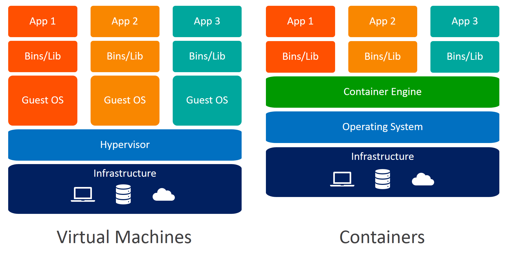
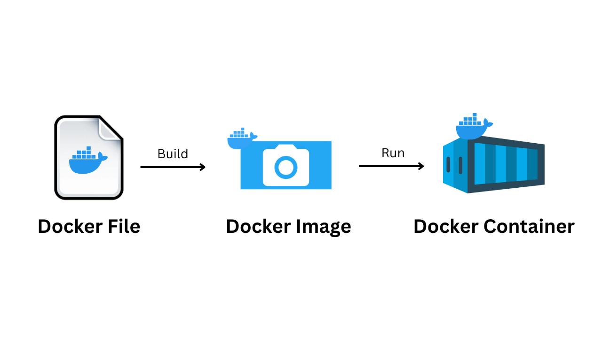
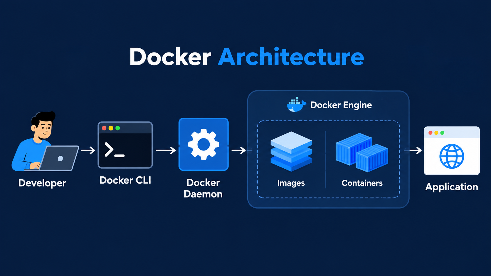
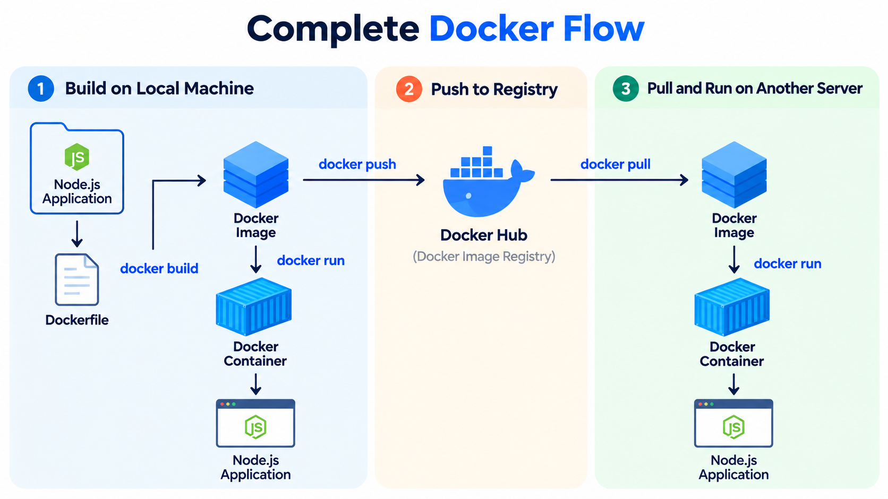

# Docker

Docker is a platform used to package and run applications inside containers.

A container contains - Application code, Dependencies, Libraries, Runtime and Configuration needed to run the application.

Instead of installing everything manually on a server, Docker lets you package the application into an **image** and run it as a **container**.

---

## Why Docker?

Docker solves the common **“works on my machine”** problem by packaging an application together with its dependencies, runtime, and required environment into a Docker image. This same image can then run consistently on a developer’s laptop, testing environment, server, or cloud, regardless of differences in the underlying system. In simple terms, Docker provides a **consistent, portable, isolated, and easy-to-deploy environment** for applications.

---

## Virtual Machines vs Containers

A **Virtual Machine (VM)** virtualizes an entire computer, including its operating system, so each VM has its own OS running on top of a hypervisor. This makes VMs more isolated but also heavier because each one needs CPU, memory, storage, and a full operating system. **Containers**, on the other hand, share the host operating system’s kernel and package only the application and its required dependencies. Because they do not need a separate full OS, containers are generally **lighter, faster to start, and more efficient with resources** than VMs.

---

## Image vs Container

A **Docker Image** is like a blueprint or template that contains everything required to run your application, such as the application code, runtime, dependencies, and configuration. A **Container** is a running instance created from that image. When you execute `docker run`, Docker takes the image and creates a container from it. The same image can be used to create multiple containers, so you can think of an **Image as the blueprint** and a **Container as the running building**.

---

## Why are containers light weight ?

Containers are lightweight because they use a technology called containerization, which allows them to share the host operating system's kernel and libraries, while still providing isolation for the application and its dependencies. This results in a smaller footprint compared to traditional virtual machines, as the containers do not need to include a full operating system. Additionally, Docker containers are designed to be minimal, only including what is necessary for the application to run, further reducing their size.

---

### Docker Engine

**Docker Engine** is the core technology that runs Docker containers. It handles tasks such as building images, creating and running containers, managing networks and volumes, and communicating with container registries. In simple words, **Docker Engine is the machinery that makes Docker work.**

---

### Docker CLI

**Docker CLI** means Docker Command Line Interface. It is the tool you use in the terminal to communicate with Docker and tell it what to do. For example, commands like `docker run nginx`, `docker ps`, `docker build`, and `docker stop` are all executed through the Docker CLI. In simple words, **Docker CLI is how you control Docker using commands.**

---

### Docker Desktop

**Docker Desktop** is an application that makes it easier to use Docker on your computer, especially on **Windows and macOS**. It provides the Docker Engine, Docker CLI, container management, images, volumes, networks, and a graphical interface. On your Mac, you can open Docker Desktop and then use commands like `docker ps` directly from your terminal.

---

### Docker Architecture

Docker architecture describes how you interact with Docker and how Docker manages your applications. When a developer runs a Docker command using the **Docker CLI**, the request is handled by the **Docker Daemon**, which is the background service responsible for managing Docker objects. The daemon works as part of the **Docker Engine** to build images and create, run, and manage containers. These containers then run the application using the required Docker images. In simple terms, the flow is -

**Developer → Docker CLI → Docker Daemon → Docker Engine → Images/Containers → Application**.

---

### Docker Client

The **Docker Client** is the interface you use to interact with Docker, usually through the `docker` command in your terminal. When you run a command such as `docker ps`, the Docker Client sends your request to the Docker Daemon, which then performs the required operation. In simple terms, **Docker Client is how you communicate with Docker**.

---

### Docker Daemon

The **Docker Daemon** is a background service that actually performs Docker operations. It manages containers, images, networks, and volumes. When you run `docker run nginx`, the Docker CLI sends the request to the daemon, and the daemon creates and starts the nginx container. In simple terms, **CLI tells Docker what to do, and the Daemon does it**.

---

### Docker Registry

A **Docker Registry** is a storage system for Docker images. Developers can **push** images to a registry and later **pull** those images to another machine or server. For example, when you run `docker pull nginx`, Docker downloads the nginx image from a registry.

---

### Docker Hub

**Docker Hub** is a popular public Docker Registry where developers can find and share container images. It provides commonly used images such as `nginx`, `node`, `redis`, `mysql`, `ubuntu`, and `postgres`. When you run `docker pull nginx` without specifying another registry, Docker commonly looks for the image on Docker Hub.

---

### Docker Objects

**Docker Objects** are the resources that Docker creates and manages. The most important ones are **Images, Containers, Networks, and Volumes**. Images act as templates for containers, containers run applications, networks allow containers to communicate with each other, and volumes provide persistent storage for data.

---

### Complete Docker Flow

Imagine you have a Node.js application. You first create a **Dockerfile** that defines how your application should be packaged, then use `docker build` to create a **Docker Image**. You can run that image using `docker run`, which creates a **Docker Container** where your Node.js application runs.

Once the image is ready, you can use `docker push` to upload it to **Docker Hub**. On another server, you can use `docker pull` to download the same image and then `docker run` to create a container and start the application. In simple terms, the flow is **Dockerfile → Build → Image → Push → Docker Hub → Pull → Image → Run → Container → Application**.
